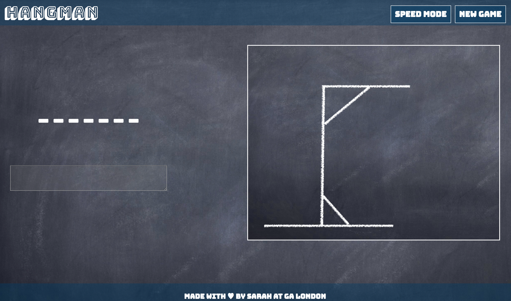

# project-1

<h1> Hangman </h1>
<h2> GA WDI London, Project 1, Feb 2017.</h2>

This Hangman game, was built between Feb 10th and Feb 16th 2017.

* This game is built in HTML5, CSS and Javascript with jQuery. 
* Animation was created using the Animate.css style sheet.
* The game is deployed via Heroku.
* The google web font 'Bungee' was used to style the game.

This is a browser hosted version of the game, for optimnal functionality google Chrome is recommended. 

<h3> Instructions for Play</h3>
This version of hangman has two play modes, the standard mode, which started automatically when the page loads, and speed mode which is started by clicking the speed mode button.

***The standard game is played as follows;***

1. a word will be generated at random from a list and will be displayed on the screen as underscores
2. the user guesses a letter by typing the guess into the text box and pressing enter
3. correct answers will be displayed in their correct position in the word, incorrect answers will be displayed below the input box and a part of the man will be drawn
4. If the man is drawn before the word is guessed you lose (7 guesses)
5. if the word is guessed before the man is drawn you win!

***Speed mode is played as follows***

1. clicking the new game button and then the speed mode button
2. On clicking the speed mode button will start the countdown, you have 35 seconds to guess the word or the man will hang!
3. Another part of the man will be drawn every 5 seconds, at which point an extra life is lost
4. the game ends when all the lives have been lost or the word is guessed correctly.

 

<h3>Unsolved Problems </h3> 
* The game is currently not responsive, therefore not optimised for small screens
* The code is not namespaced

<h3>Challenges </h3> 
The most challenging game logic to solve was to match the user guesses with the random word and to display the correct guesses in the appropriate position in the word. I achieved this creating an array of correct characters and looping through this array to find matching letters, and then making this array into a string in order to display it. 

Styling the game was also challenging, espcially positioning the footer at the base of the page given the relatively empty page. I achieved this by creating an empty wrapper div to fill the space. 

